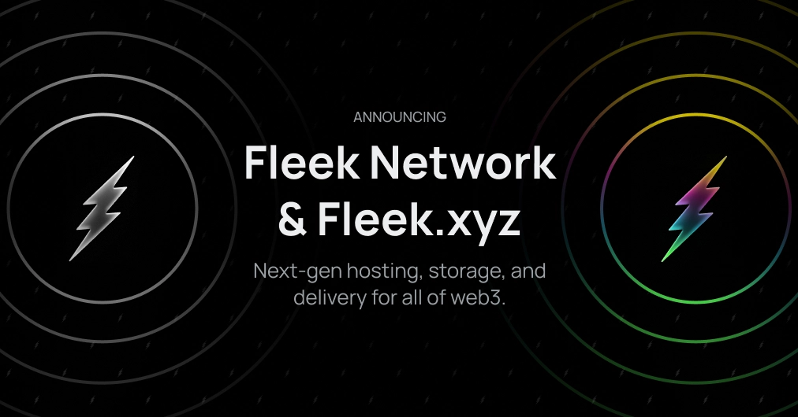

# О проекте Fleek

Fleek - это инновационная платформа, предоставляющая решения для децентрализованного хостинга, хранения и разработки.

## Особенности
- **Децентрализованное хранение**: Использование блокчейн технологий для безопасного хранения данных.
- **Легкость использования**: Удобный интерфейс для разработчиков и пользователей.
- **Поддержка сообщества**: Активное сообщество и поддержка пользователей.

## Миссия
Наша миссия - предоставить удобные и безопасные инструменты для работы с децентрализованными технологиями.

## Контакты
- [Официальный сайт](https://fleek.network)
- [GitHub](https://github.com/fleek)

